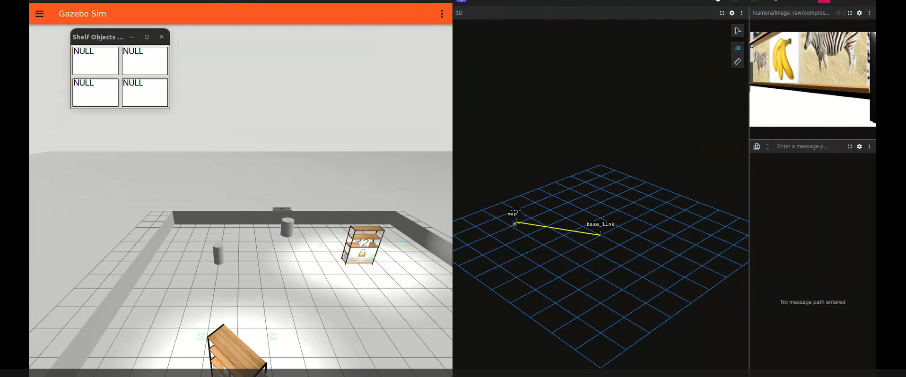
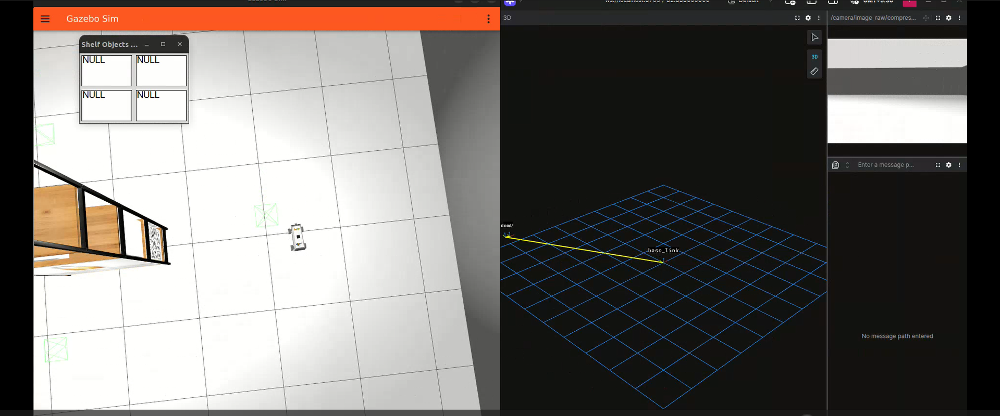
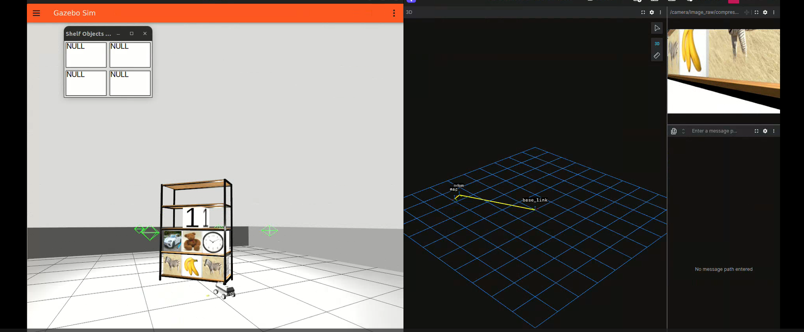

# Autonomous Warehouse Inventory Robot (ROS 2)

This project implements an autonomous mobile robot that explores an unknown
warehouse environment, navigates to shelves, and performs real-time inventory
detection and counting using computer vision and autonomous navigation.

The robot uses SLAM for mapping, Nav2 for path planning, and YOLO-based object
detection to identify and count items on shelves.

## Demo
**Working Video**: https://www.youtube.com/watch?v=7wsWYUg1ylI  
**Detailed Report**: [Project Report](docs/project_report.pdf)

### SLAM Mapping Output


### Object Detection from Robot Camera


### Autonomous Navigation and Path Planning


## Key Features
- Autonomous exploration of unknown environments
- SLAM-based mapping and localization
- Frontier-based exploration
- Nav2 global and local path planning
- YOLO-based object detection and counting
- Real-time inventory tracking in simulation

## Tech Stack
- ROS 2 (Humble)
- Gazebo Simulation
- Nav2 Navigation Stack
- SLAM Toolbox
- YOLOv5 (TFLite)
- OpenCV
- Python

## How the System Works
1. Robot spawns in a simulated warehouse environment
2. SLAM builds an occupancy grid map
3. Exploration logic selects unexplored frontiers
4. Nav2 plans safe paths to goals
5. Robot aligns with shelves
6. Camera feed is processed using YOLO
7. Objects are detected and counted
8. Inventory data is published to ROS topics

## Running the Project (Simulation)

This repository contains a ROS 2 Python package intended to be built inside
a ROS 2 workspace.

```bash
mkdir -p ~/ros2_ws/src
cd ~/ros2_ws/src
git clone https://github.com/<your-username>/<repo-name>
cd ..
colcon build
source install/setup.bash
ros2 run <package_name> b3rb_ros_warehouse

